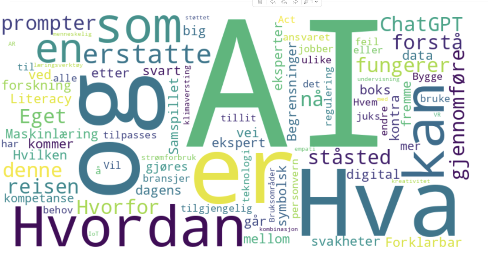

.. _00_run_llms:

An AI is a big piece of software, that you can talk to. It will give you differend kinds of response depending on its programming and functionality. You may talk to the LLM from a web page, or from an app. At the UiO we have had access to Chat GPT since 2023. In this course we want to learn you what goes on behind the interface. You will learn more on how to start up your own AI from a Script in Jupyter Lab.

**In this course we will go from 1 to 100 in two days**

You will come out of our classroom fluent in how to set up, prompt, use parameters and regulate the creativity of the language model. This process of using open or available LLModels from Huggingface is not commercial and might have the potential to bringing science forward with greater speed than what we have seen before.

Uio, the Fox and the Nvidia cluster
-----------------------------------
In this documentation, you will learn how to set up an AI process at the UiO Nvidia Cluster. The documentation belongs to a course held as a part of Digital Scholarship Days 2025. The course is for employees at the University of Oslo. If you are in the interest group, you may `sign up here <https://www.ub.uio.no/english/courses-events/events/dsc/2025/digital-scholarship-days/01-run%20large%20language%20models%20through%20Educloud%20UiO>`_. AIs from Huggingface run on a Transformer architecture. The interactive development environment we are going to use, Jupyter Lab, is an effective way of showing what goes on behind the interface of the AI. You will learn how the functionality of the various language models are put together. You will also learn to set parameters, and how they affect the output. This will give some insight into how the AI of our times work.

.. todo:: 
   Todo 0.1: Språkvask engelsk: spør noen som er flytende i engelsk om hjelp.

.. todo:: 
   Todo 0.2: Legg emneord på alle kapitlene der det mangler.

.. toctree::
   :maxdepth: 2
   :caption: Table of Contents
   :titlesonly:

   00_run_llms
   01_preparations
   02_downloading_packages
   03_ai_board
   04_hello_world
   05_login
   06_prompting
   07_pirat
   08_parameters
   09_pegasus
   10_valami
   11_juoga
   30_todo

Indices and tables
==================

* :ref:`genindex`
* :ref:`search`

Run large language models through Educloud UiO
===========

.. index:: algo

.. image:: fox.png

Learning objectives
-------------------
- Learn how large language models (LLMs) are made
- learn how to use UiOs infrastructure for computational power to use various open LLMs
- Learn how to create effective promts and adjust relevant parameters
- Connect the model to your own data in the form of PDFs og text data.
- Be fluent in how to set up your own model in Jupyter Lab, so that you may use the process independently for interaction with open LLMs

