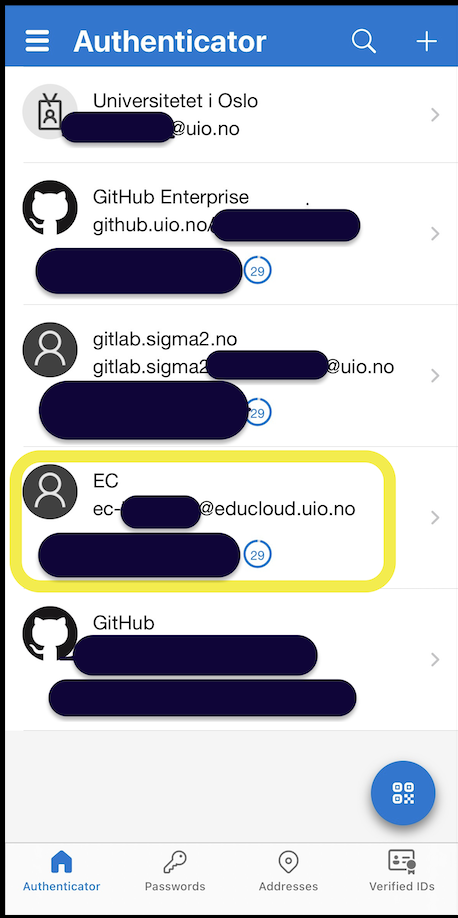
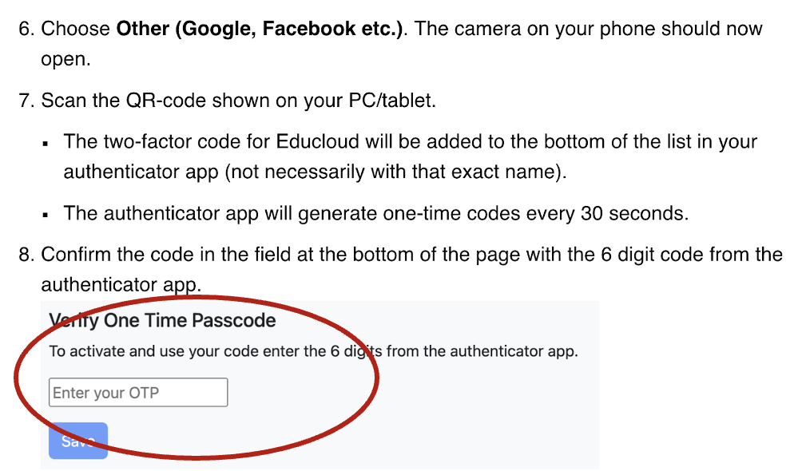

.. _01_preparations: Before you come:
01 Preparations: Before you come
===============

.. index:: preparations, two-factor, Microsoft Authenticator
You have done this already: `Sign up <https://www.ub.uio.no/english/courses-events/events/dsc/2025/digital-scholarship-days/01-run%20large%20language%20models%20through%20Educloud%20UiO>`_ for the course.

First time users of Educloud
------------
* `Log in <https://selfservice.educloud.no/membershipapplication>`_  with Your bank ID  and apply for group membership in **ec443**

Set up Authentication with Microsoft authenticator
--------------------------------------------
* If you do not have Microsoft Authenticator, you can download from App Store (iPhone) or Google Play (Android)
*  Make your two factor work with the QR code. Follow `this recipe <https://www.uio.no/english/services/it/research/platforms/edu-research/help/two-factor-authentication.html>`_.
* Setting the password: `Here is how <https://www.uio.no/english/services/it/research/platforms/edu-research/help/change-password.html>`_.
* You should have your Microsoft Authenticator open, and at the same time have the screen open with login on "Change your OTP". You need to have your mobile camera enabled. The system will be set up automatically via a QR code on the screen, that is seen by the Authenticator app.
* In the Authenticator --> Home --> Microsoft entra ID --> Konfigurer totrinnsbekreftelse

.. image:: qr_sladdet.png

Read the whole page down
-------------------------
Note that you may have different sites on your phone, that generate separate codes. Velow, you will see an example of how the phone of an advances user may look like. The Educloud assess is marked with yellow.

You will succed in your setup, if you read the whole `page down <https://www.uio.no/english/services/it/research/platforms/edu-research/help/two-factor-authentication.html>`_, because the most important step is explained at the bottom of the page:

Already users on Educloud and for first time users that have created an user in Educloud:
--------------------------
* Apply for project membership to ec443
* send email to `Ragnhild <ragnhild.sundsbak@ub.uio.no>`_ with heading "I applied for membership in ec443"
* When the project manager has approved of your application, log in to Educloud with your two factor authenticator.

Final step - Is it working?
---------------
*  Try your setup on `Educloud on demand <https://ood.educloud.no>`_
*  Try your setup on `Educloud on demand <https://ondemand.educloud.no/>`_
