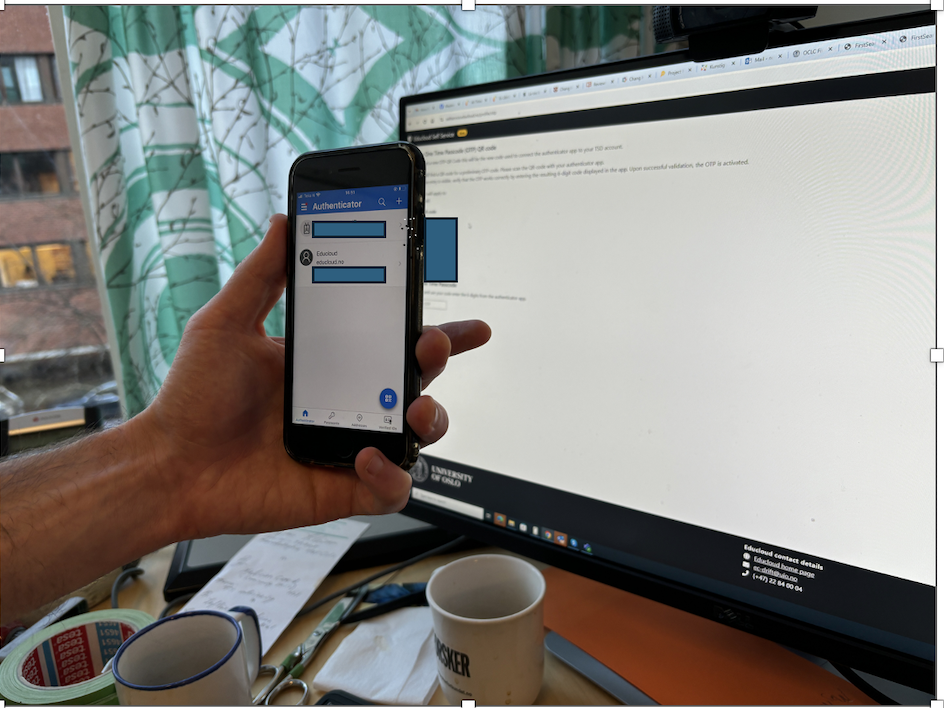

.. _01_preparations: Before you come:
01 Preparations: Before you come
===============

.. index:: something
You have done this already: `Sign up <https://www.ub.uio.no/english/courses-events/events/dsc/2025/digital-scholarship-days/01-run%20large%20language%20models%20through%20Educloud%20UiO>`_ for the course.

.. todo:: 
   Todo 0.3: Splitt i First time og already users, slik at det blir en for en.

First time users of Educloud
------------
* Download Microsoft Authenticator on your phone. It may be downloaded from App Store (iPhone) or Google Play (Android)
* Log in with `Your bank ID <https://selfservice.educloud.no/membershipapplication>`_  and apply for group membership in ec443

Set up Authentication with microsoft authenticator
--------------------------------------------
*  Make your two factor work with the QR code. Follow `this recipe <https://www.uio.no/english/services/it/research/platforms/edu-research/help/two-factor-authentication.html>`_.
* Setting the password: `Here is how <https://www.uio.no/english/services/it/research/platforms/edu-research/help/change-password.html>`_.
* You should have your Microsoft Authenticator open, and at the same time have the screen open with login on "Change your OTP". You need to have your mobile camera enabled. The system will be set up automatically via a QR code on the screen, that is seen by the Authenticator app.
* In the Authenticator --> Home --> Microsoft entra ID --> Konfigurer totrinnsbekreftelse

Already users on Educloud:
--------------------------
* Apply for project membership to ec443
* send email to `Ragnhild <ragnhild.sundsbak@ub.uio.no>`_ with heading "I applied for membership in ec443"
* When the project manager has approved of your application, log in to Educloud with your two factor authenticator.

Important step for veryone
---------------------------
*  Try your setup on `Educloud on demand <https://ood.educloud.no>`_
*  Try your setup on `Educloud on demand <https://ondemand.educloud.no/>`_

Log in through SSH in Bash, Terminal, Command prompt or ledetekst and making your own virtual environment on ec443
-------------------------------------------------
.. index:: login, ssh, bash, terminal

Open the Command prompt (PC) or Terminal. Log in to Fox using ssh. You will need to read the information on the USIT page `Fox Account Creation and Login (SSH) <https://www.uio.no/english/services/it/research/platforms/edu-research/help/fox/account-login.md>`_

Do not copy this. This is just an example of what it may look like when the terminal/ command prompt is ready for your input
Terminal view 1::
   
   Last login: Sat Nov  2 10:51:34 on console
   (base) navnesenmaskin@eduroam-193-157-163-121 ~ %

Terminal view 2::
   
   ssh ec-navnesen@fox.educloud.no

You will be asked for your password and one time code. The One time code changes all the time. Sometimes you will have to try again. When you are in, you will see the Fox, just like terminal view 3 below.

Terminal view 3::

   Welcome to FOX

      "'~-.       .-~'"
      |   .'"""""'.   |
      \`_"         "_'/
       )             (
       /   0     0   \
      <               >
    .< __.-'. _ .'-.__ >.
      "-.._  (#)  _..-"
           `-:_:-'
   The HPC Cluster in Educloud

In the coming examples, if you have problems copying and pasting into the terminal, it is maybe the best practice to write in the commands directly. But write slowly so that you see that it gets right, before pressing enter. Do not fear. Remember also to fill in the right details where it says [your username at uio]

**Change into the right subdirectory**

Terminal view 4::

   cd /fp/projects01/ec443

**Make a directory at ec443, where you plan to have your working files**

Terminal view 5::

   mkdir [your username at uio]

**Remember to put in your username before you copy and paste!**

**Making a virtual env for python packages**

Terminal view 6::

   python -m venv /fp/projects01/ec443/[your username at uio]/my_venv

**Aktivate your venv**

Terminal view 7::

   source /fp/projects01/ec443/[your username at uio)/my_venv/bin/activate

You can now enter the Fox in the Browser, and wheck if the folder with your username is in the right place. See next lesson.
