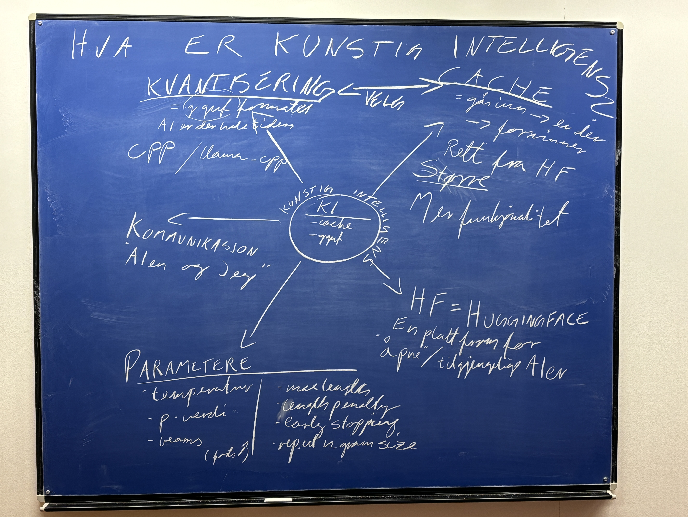
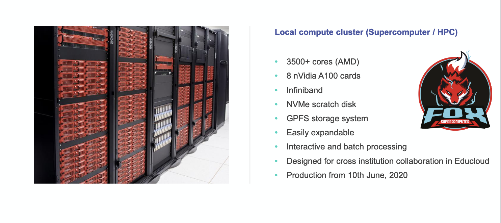

.. _02_ai_board:
02 Getting overview with AI on the blackboard
=================

.. index:: artificial, intelligence, cluster, HPC, Transformers, CUDA, .gguf, llama_cpp

Hugging face and the AIs
___________________________
"Hugging Face is a machine learning (ML) and data science platform and community that helps users build, deploy and train machine learning models." Ben Lutkevich on `Tech Target <https://www.techtarget.com/whatis/definition/Hugging-Face>`_

`Hugging face <https://huggingface.co/>`_ is a good place to start, when you want to familiarize yourself with the LLMs. However, in this course you do not need to download them, because we, the instructors have already done some of the work for you. If you want to learn, keep reading!

Fox, Cuda and Cluster
---------------------
Wether you like it or not, AI may be your new colleague. When i talk about aspects of the setup on Fox, i say Cuda, Fox or Cluster.

**CUDA** means Compute Unified Device Architecture. According to Wikipedia is a proprietary parallel computing platform and interface, that allows software to use certain types of graphics processing units (GPUs) (Wikipedia Nov. 12th 2024). It has programming languages C++, Cuda C and libraries for mathemathics like cuBLAS. Cuda is made by the firm Nvidia.

**Cluster**, The Fox is a `High performance computing cluster for Educloud research users <https://www.uio.no/english/services/it/research/hpc/fox/>`_. A Computing Cluster is a set of connected computers that work together so closely that in many respects they function as a single computer.

(UiO it department 2024: dScience – Centre for Computational and Data Science)

**HPC**, A High Performance Computing cluster

**Transformers** A transformer is a learning architecture developed by researchers at Google and based on the multi-head attention mechanism, proposed in the 2017 paper "Attention Is All You Need".

**The .gguf format** developed by @ggerganov is a quantified AI file format that that stores both tensors and metadata in a single file.

**llama_cpp** is a C++ library that allows us to run quantized models. The cpp format also developed by developed by @ggerganov interprets the GGML and GGUF formats.

  ..note:
  Task: Write a list over concepts that you do not understand. Go in pairs, and discuss the concepts you want to elaborate on. Use google, UiO GPT or an encyclopedia from the library.

.. todo:: 
  Todo 2.1: Vi må legge inn oppgaver, i hvert eneste kapittel.
