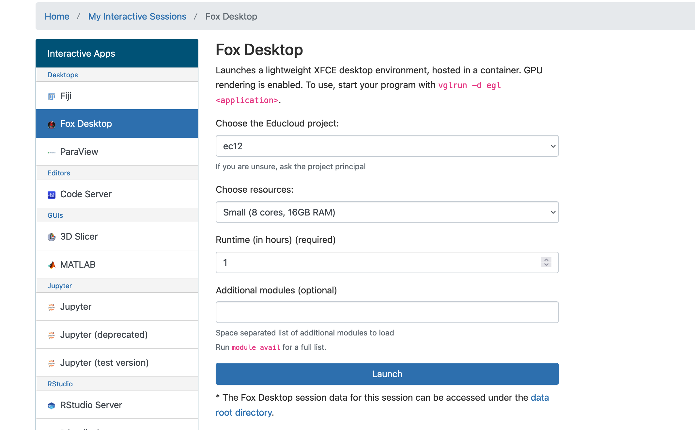
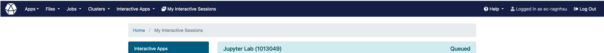

.. _02_easy_login:
02 Login to browser: Easy way
=====================
.. index:: Fox, server, A100, GPU, hardware, NVIDIA

Fox has a GPU accelerated part of the system, with four NVIDIA A100 cards each, as well as three nodes with four NVIDIA RTX 3090 cards from IFI. These systems of hardware are fit for running AI on.

How to order a job on the Fox
____________________________

When you are logged on to `the Fox <https://ood.educloud.no/>`_, move like this: from the left menu, go to Jupyter lab --> ec443 Choose one of the Nvidia GPUs from the drop down menu --> Rumtime. 1h --> Jupyter variant, Jupyter lab --> (You need not choose jupyter module, as the last version is pre selected) -->  Launch. You are now in the line to get into the Jupyter lab on UiO Fox. You can get tea or coffee, and have a chat with your colleague, while you wait. The waiting time depends on how much you are asking for, when it comes to machine power and time.

.. warning:: 

  Try to get used to experiencing small technical problems like warnings and kernel stops. These are just annoying hickups and usually not problematic.

.. note::

  Task 2.1: Explore the top menu and look into the folders. What does it look like? Familiarize yourself with the browser view of Fox. For a beginner, it is useful to learn how to copy paths and move or copy files and folders between the project area and the Home Directory.

.. note::

  Task 2.2: Look for the left menu in the browser view. Go to Home directory --> Nev directory (White button on second top menu) --> Directory name: documents. This is where you may store the documents for this workshop, and later your own material.

  Task 2.3: Take some, or all of the content from this path: /fp/projects01/ec443/documents, and move it into your own documents folder that you made on your own home directory.
