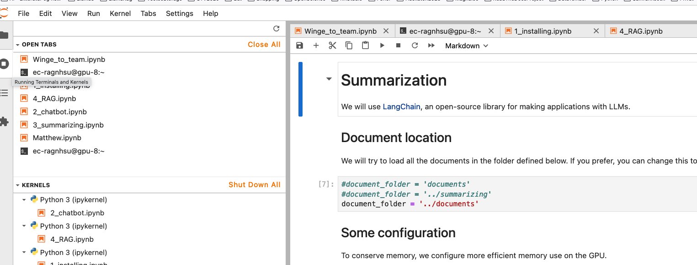

.. _03_downloading_packages:

03 Installing software
========================

In this course, we have tried to make it easy for you, through making the code available. We still have to spend some time familiarizing outselves with copying, pasting and running the code in the cells of Jupyter lab.

.. note::

  Task 3.1: Look around in Jupyter lab. Open another tab in your browser, and google subjects like "jupyter lab cheat sheet" and "run cell jupyter lab".

Jupyter lab keyboard shortcuts
-------------------------------

It might be useful for you to look at some `Jupyter lab shortcuts <https://gist.github.com/discdiver/9e00618756d120a8c9fa344ac1c375ac>`_

Hello world
-------------
.. note::

  Task 3.2: Explore the top menu of jupyter lab, and see what is behind categories like File, Edit, View and Run. How do you add or remove cells in a .ipynb document?

.. note::

  Task 3.3: Copy the content of the cell below, and run it in Jupyter lab, in an .ipynb document.

Run this Cell::

  print('Hello, world.')

.. note::

  Task 3.3: How do we run a cell in Jupyter lab? Try to find shortcut and the menues.

  Task 3.4: How do we stop a cell from running?

  Task 3.5: How do we change the content of a cell from markdown to code, and back again? What is the point with this?

Use only the two largest A100 machines for this lesson. When you do RAG, you will have to use the largest GPU (1xNvidia A100 80 GB, 24 CPU cores, 250 GB RAM
---------------------------------------------------------------------------------------------------------------------------------------------------------------
We are going to download packages. We have to do this the first time we are going to use the models. The second and thirs time, you may neutralice the !pip install code with a # in front of the cell.

Cell 1::

   # Make installations
   !pip install --upgrade pip huggingface-hub langchain langchain-community langchain-huggingface sentence-transformers    sentencepiece

Output:

Cell 2::

   # !pip install --upgrade unstructured[all-docs] langchain-unstructured

Output example:

Cell 3::
  
  !pip install --upgrade faiss-cpu

Output

If you run on ec443, you do not need to log into Huggingface. This is why next cell is optional. If you run on your own, or want to download a model that is not previously used by the group, you will need to make an account at Huggingface, and store the token you get. In that case you will be able to find the token under your profile, in the right side of the top menu "access tokens". For the gated models, you need to apply, before you are allowed to download. We recommend that you store your token in a safe place, and do not share it with anyone.

Optional cell for entering your HF token::

  from huggingface_hub import login
  login()
