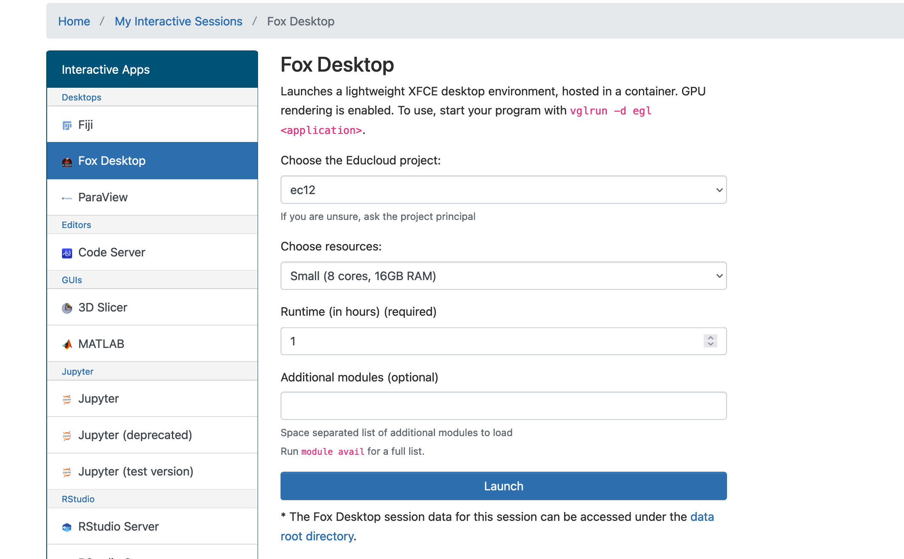

.. _03_login:
03 Login to browser and Terminal
=====================
.. index:: Fox, server, CUDA, A100, GPU, hardware

Fox has a GPU accelerated part of the system, with four NVIDIA A100 cards each, as well as three nodes with four NVIDIA RTX 3090 cards from IFI. These systems of hardware are fit for running AI on.

Log in to Fox and Educloud in the browser
-----------------------------------------
When you are logged on to `the Fox <https://oidc.fp.educloud.no/>`_, move like this: from the left menu, go to Jupyter lab --> ec443 Choose one of the Nvidia GPUs from the drop down menu --> Rumtime. 1h --> Jupyter variant, Jupyter lab --> (You need not choose jupyter module, as the last version is pre selected) -->  Launch. You are now in the line to get into the Jupyter lab on UiO Fox. You can get tea or coffee, and have a chat with your colleague, while you wait. The waiting time depends on how much you are asking for.

At the Fox server, you have your own storage space. There is also a common space for the group on the server. This is where the AIs are located, and where the AI will be temporarily cached when you download it from Huggingface. In order to get the AI to work in Jupyter lab, it is essential that you set up the paths in the right way. Take a look around, and see if you can think of a good way to organize your project. 

.. note::

   First task: Visit Huggingface and search for google/Pegasus. What do you see? Switch the search to meta-llama/Llama-3.1-8B-Instruct and read. Is this a model that you can find at Fox? What format is it in? Find the format of the Llama AI at Fox, and google it, in order to find out more about this dataformat.

Log in to Fox and Educloud through SSH, in Bash or Terminal
-------------------------------------------------

.. index:: login, ssh, bash, terminal

Open the Command prompt (PC) or Terminal. Log in to Fox using ssh. You will need to read the information on the USIT page `Fox Account Creation and Login (SSH) <https://www.uio.no/english/services/it/research/platforms/edu-research/help/fox/account-login.md>`_

Terminal view 1::
   
   Last login: Sat Nov  2 10:51:34 on console
   (base) navnesenmaskin@eduroam-193-157-163-121 ~ %

Terminal view 2::
   
   Last login: Sat Nov  2 10:51:34 on console
   (base) navnesen@eduroam-193-157-163-121 ~ % ssh ec-navnesen@fox.educloud.no
   (ec-navnesen@fox.educloud.no) One-Time_Code: 

Terminal view 3::

   Welcome to FOX

      "'~-.       .-~'"
      |   .'"""""'.   |
      \`_"         "_'/
       )             (
       /   0     0   \
      <               >
    .< __.-'. _ .'-.__ >.
      "-.._  (#)  _..-"
           `-:_:-'
   The HPC Cluster in Educloud

Remember to fill in the right details where it says [your username at uio]

Terminal view 4::
   # change into the right subdirectory
   cd /fp/projects01/ec443

   # make a directory at ec443, where you plan to have your working files
   mkdir [your username at uio]

Terminal view 5::
   # making a virtual env for python packages
   python -m venv /fp/projects01/ec443/my_venv/[your username at uio]
   
Terminal view 6::

# Aktivér ditt venv
source /fp/projects01/ec367/ragnhsu/venv_transformers/bin/activate

# Installer transformers og torch i venv
pip install transformers
pip install torch

Further reading
--------------
If you wish, you may read more about the `technical specifications <https://www.uio.no/english/services/it/research/platforms/edu-research/help/fox/system-overview.md>`_ on Fox.

