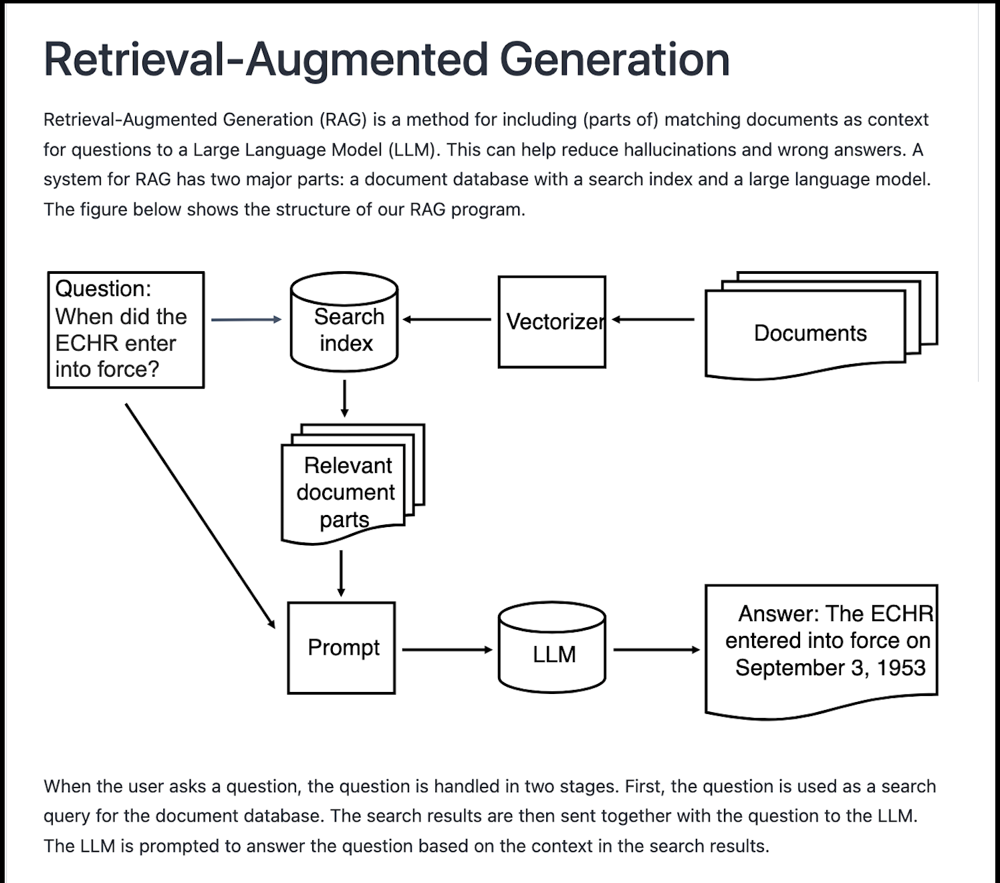

.. _05 rag:

Retrieval Augmented Generation (RAG)
========================================
.. index:: RAG, documents, retrieval augmented generation, gjenvinningsutvidet tekstgenerering

Retrieval-Augmented Generation (RAG/ gjenfinningsutvidet generasjon i LLM) er en måte å inkludere (deler av) matching documents as context for questions to a Large Language Model (LLM). This can help reduce hallucinations and wrong answers. A system for RAG has two major parts: a document database with a search index and a large language model. The figure below shows the structure of our RAG program.

Our project is the result of team work. We have two sets of documentation pages. Thanks to our `team member for illustrating the process <https://uio-library.github.io/LLM-course/4_RAG.html>`_ .

Recommended location of the document folder: Replace the section for username with your own.

Code view 1::

  #document_folder = '/fp/projects01/ec443/documents'
  document_folder = '/fp/homes01/u01/{ec-username}/documents'

The location of the models repeated.

Code view 2::

  %env HF_HOME=/fp/projects01/ec443/huggingface/cache/

code view 3::

  from langchain_huggingface.llms import HuggingFacePipeline
  
  llm = HuggingFacePipeline.from_model_id(
      model_id='mistralai/Mistral-7B-Instruct-v0.3',
      task='text-generation',
      device=0,
      pipeline_kwargs={
          'max_new_tokens': 500,
          'do_sample': True,
          'temperature': 0.3,
          'num_beams': 4
      }
  )

First, we are going to use the language model without connecting it to the documents. The output will be what the model knows from before, on the subject we ask.

code view 4::

  # Use with models from Meta
  #llm.pipeline.tokenizer.pad_token_id = llm.pipeline.tokenizer.eos_token_id
  
  query = 'What are the major contributions of the Trivandrum Observatory?'
  output = llm.invoke(query)

The answer will be printed in markdown.

code view 5::
  
  from IPython.display import Markdown
  display(Markdown(output))

The Vectorizer
---------------
Text must be vectorized before it can be processed. Our HuggingFace pipeline will do that automatically for the large language model. But we must make a vectorizer for the search index for our documents database. We use a vectorizer called a word embedding model from HuggingFace. Again, the HuggingFace library will automatically download the model. You can read more on the `Embedding model here <https://huggingface.co/BAAI/bge-m3>`_ . The developer writes this in the readme file: "BGE M3 is an embedding model supporting dense retrieval, lexical matching and multi-vector interaction".

code view 6::
  
  from langchain_community.embeddings import HuggingFaceBgeEmbeddings
  
  huggingface_embeddings = HuggingFaceBgeEmbeddings(
      model_name='BAAI/bge-m3',
      model_kwargs = {'device': 'cuda:0'},
      #or: model_kwargs={'device':'cpu'},
      encode_kwargs={'normalize_embeddings': True}
  )

Loading the documents
-----------------------

code view 7::
  
  from langchain_community.document_loaders import DirectoryLoader
  
  loader = DirectoryLoader(document_folder)
  documents = loader.load()

Counting the documents.

code view 8::
  
  print(f'Number of documents:', len(documents))
  print('Maximum document length: ', max([len(doc.page_content) for doc in documents]))

We can examine one of the documents

code view 9::
  
  print(documents[0])

Splitting the documents
--------------------------

code view 9::
  
  from langchain.text_splitter import RecursiveCharacterTextSplitter
  
  text_splitter = RecursiveCharacterTextSplitter(
      chunk_size = 700, #  Could be more, for larger models like mistralai/Ministral-8B-Instruct-2410
      chunk_overlap  = 200,
  )
  documents = text_splitter.split_documents(documents)

We can check if the maximum document length has changed:

code view 10::

  print(f'Number of documents:', len(documents))
  print('Maximum document length: ', max([len(doc.page_content) for doc in documents]))

The Document Index
--------------------

code view 11::
  
  from langchain_community.vectorstores import FAISS
  vectorstore = FAISS.from_documents(documents, huggingface_embeddings)

code view 12::
  
  relevant_documents = vectorstore.similarity_search(query)
  print(f'Number of documents found: {len(relevant_documents)}')

code view 13::
  
  print(relevant_documents[0].page_content)

For our RAG application we need to access the search engine through an interface called a retriever:

code view 14::
  
  retriever = vectorstore.as_retriever(search_kwargs={'k': 3})

Making a prompt
----------------

code view 15::
  
  from langchain.prompts import PromptTemplate
  
  prompt_template = '''You are an assistant for question-answering tasks.
  Use the following pieces of retrieved context to answer the question.
  Context: {context}
  
  Question: {input}
  
  Answer:
  '''
  
  prompt = PromptTemplate(template=prompt_template,
                          input_variables=['context', 'input'])

Making the "Chatbot"
---------------------

code view 16::
  
  from langchain.chains import create_retrieval_chain
  from langchain.chains.combine_documents import create_stuff_documents_chain
  
  combine_documents_chain = create_stuff_documents_chain(llm, prompt)
  rag_chain = create_retrieval_chain(retriever, combine_documents_chain)

Asking the "Chatbot"
----------------------

code view 17::
  
  result = rag_chain.invoke({'input': query})

  
code view 18::
  
  print(result['answer'])

.. image:: copy_cell.png

.. note::

  Task 10.2: Use copy cell in jupyter lab in order to get e a copy of the summarization cell. Change some of the parameters, and see if the output changes.
