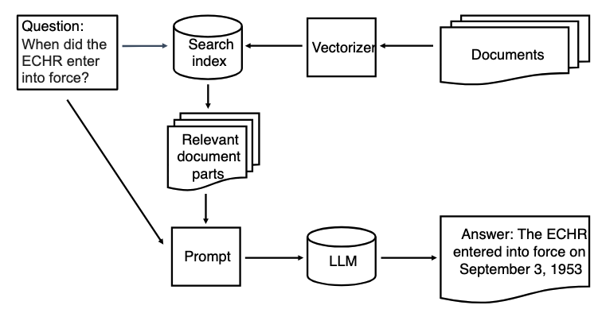

.. _05 rag:

Retrieval-Augmented Generation (RAG)
======================================

.. index:: RAG, dokumenter, retrieval augmented generation, gjenfinningsforsterket tekstgenerering

På norsk: Gjenfinningsforsterket tekstgenerering
-------------------------------------------------

Gjenfinningsforsterket tekstgenerering eller RAG er en måte å inkludere (deler av) dokumenter for å gi kontekst til spørsmål som man stiller en språkmodell. Dette kan redusere tendensen til hallusinering eller andre feil i svarene. Et system for gjenfinningsutvidet tekstgenerering har to hoveddeler. For det første en dokumentdatabase med søkeindeks og for det andre en stor språkmodell. Tegningen under viser RAG programmets struktur.

Bilde fra `Retrieval-Augmented Generation <https://uio-library.github.io/LLM-course/4_RAG.html>`_ .
Når brukeren stiller et spørsmål, vil det bli håndtert i to steg. Først blir det brukt til et søk i dokumentdatabasen. Søkeresultatene blir sendt sammen med spørsmålet til språkmodellen. Språkmodellen blir bedt om å svare på spørsmålene basert på konteksten i søkeresultatene.

Vi vil bruke `LangChain <https://www.langchain.com/>`_, et bibliotek med åpen kildekode, som brukes til å lage programmer med store språkmodeller. Dette kapittelet er inspirert av artikkelen `Retrieval-Augmented Generation (RAG) with open-source Hugging Face LLMs using LangChain <https://medium.com/@jiangan0808/retrieval-augmented-generation-rag-with-open-source-hugging-face-llms-using-langchain-bd618371be9d>`_.

.. admonition:: Oppgave: Lage en ny notebook
   :collapsible: closed

    Lag en ny Jupyter Notebook som du kaller RAG ved å velge Filmenyen i JupyterLab, deretter "New" og "Notebook". Hvis du blir spurt om å velge en kjerne, velg “Python 3”. Gi den nye notebooken et navn ved å velge Filmenyen i JupyterLab og deretter "Rename Notebook". Bruk navnet RAG.

.. admonition:: Oppgave: Stopp gamle kjerner
   :collapsible: closed

    JupyterLab bruker en Python kjerne til å kjøre koden i hver notebook. For å frigjøre GPU minne som ble brukt i forrige kapittel, bør du stoppe kjernen for den notebooken. I menyen på venstre side av JupyterLab, velg den mørke sirkelen med en hvit firkant i. Deretter velger du KERNELS og "Shut Down All".

Dokumentets plassering
------------------------

Vi har samlet noen artikler som har Creative Commons lisens. Vi skal forsøke å laste opp alle dokumentene fra mappen som det vises til under. Hvis du vil, kan du endre stien til din egen mappe på hjemmeområdet::

   document_folder = '/fp/projects01/ec443/documents'

Språkmodellen
---------------

Vi skal bruke modeller fra `HuggingFace <https://huggingface.co/>`_, en nettside som har verktøy og modeller til maskinlæring. Vi kommer til å bruke språkmodellen med åpne vekter og parametere, `meta-llama/Llama-3.2-3B-Instruct <https://huggingface.co/meta-llama/Llama-3.2-3B-Instruct>`_, fordi den er liten nok til at vi kan bruke den med de minste GPUene på Fox. Hvis du kjører på en GPU med mer minne, kan du få bedre resultater med en større modell, som for eksempel `mistralai/Ministral-8B-Instruct-2410 <https://huggingface.co/mistralai/Ministral-8B-Instruct-2410>`_.

Modellens plassering
---------------------

Vi må laste ned modellen som vi skal bruke. Vi kjører programmet på tungregningsklyngen `Fox ved UiO <https://www.uio.no/tjenester/it/forskning/beregning/fox/index.html>`_. Vi må peke på stedet der vårt program skal lagre modellene som vi laster ned fra HuggingFace::

   import os
   os.environ['HF_HOME'] = '/fp/projects01/ec443/huggingface/cache/'

.. note::

   Hvis du kjører programmene lokalt på din egen datamaskin, trenger du kanskje ikke sette ``HF_HOME``.

Modellen
---------

Nå er vi klare til å laste opp og bruke modellen. For å gjøre dette, lager vi en "pipeline". En pipeline kan bestå av flere steg, men i dette tilfellet trenger vi bare ett steg. Vi kan bruke metoden ``HuggingFacePipeline.from_model_id()``, som automatisk laster den spesifiserte modellen fra HuggingFace.

Som før, sjekker vi om vi har GPU tilgjengelig::

   import torch
   device = 0 if torch.cuda.is_available() else -1

::

   from langchain_community.llms import HuggingFacePipeline
   
   llm = HuggingFacePipeline.from_model_id(
         model_id='meta-llama/Llama-3.2-3B-Instruct',
         task='text-generation',
         device=0,
         pipeline_kwargs={
            'max_new_tokens': 500,
            'do_sample': True,
            'temperature': 0.3,
            'num_beams': 4
          }
      )

.. note:: Pipeline argumenter

   Vi kan gi noen argumenter til pipelinen:
   
       ``model_id``: modellens navn fra HuggingFace
   
       ``task``: oppgaven du planlegger å bruke modellen til
   
       ``device``: GPU maskinvaren som enheten bruker. Hvis vi ikke spesifiserer en enhet, vil GPU ikke brukes.
   
       ``pipeline_kwargs``: (keyword arguments) tilleggsparametere som gis til modellen
   
            ``max_new_tokens``: max lengde på teksten som genereres
   
            ``do_sample``: som standard, det mest sannsynlige ordet som kan velges. Dette gjør outputten mer deterministisk. Vi kan sørge for en mer tilfeldig utvelging ved å angi hvor mange ord blant de mest sannsynlige som det skal velges mellom.
   
            ``temperature``: temperaturkontrollen er den statistiske distribusjonen til neste ord. Vanligvis et tall mellom 0 and 1. Lav temperatur øker sannsynligheten for vanlige ord. Høy temperatur øker muligheten for sjeldnere ord i output. Utviklerne har ofte en anbefaling hva angår temperatur. Vi bruker anbefalingen som et startpunkt.
   
            ``num_beams``: som standard gir modellen en enkel sekvens av tokens/ord. Med beam search, vil programmet bygge flere samtidige sekvenser, og deretter velge den beste til slutt.

.. tip::

   Hvis du jobber på en maskin med mindre minne, trenger du kanskje en mindre modell. Du kan prøve for eksempel ``mistralai/Mistral-7B-Instruct-v0.3`` eller ``meta-llama/Llama-3.2-1B-Instruct``. Sistnevnte har bare 1 miliard parametere, og det kan være mulig å bruke den på en bærbar maskin, avhengig av hvor mye minnekapasitet den har.

Språkmodellen i bruk
----------------------

Nå er språkmodellen klar til bruk. La oss forsøke å bruke den uten RAG. Vi kan sende en instruks::

   query = 'What are the major contributions of the Trivandrum Observatory?'
   output = llm.invoke(query)
   print(output)

Svaret ble generert på grunnlag av informasjonen som befinner seg fra før av i språkmodellen. For å forbedre presisjonen i svaret, kan vi sørge for at språkmodellen får mer kontekst til spørsmålet. For å gjøre dette, må vi laste inn dokumentsamlingen.

Vektorisering
--------------

Tekst må vektoriseres før den kan bli bearbeidet. Vår HuggingFace pipeline vil gjøre det automatisk for språkmodellen, men vi må lage en vektorisator til søkeindeksen som vi skal bruke til dokumentdatabasen vår. Vi bruker en vektorisator som på engelsk kalles en word embedding model fra HuggingFace. HuggingFace biblioteket vil automatisk laste ned modellen::
   
   from langchain_huggingface import HuggingFaceEmbeddings
   
   huggingface_embeddings = HuggingFaceEmbeddings(
       model_name='BAAI/bge-m3',
       model_kwargs = {'device': 'cuda:0'},
       #or: model_kwargs={'device':'cpu'},
       encode_kwargs={'normalize_embeddings': True}
   )

.. note:: Embeddingens argumenter
   
   Dette er argumentene til embedding modellen:
   
       * ``model_name``: modellens navn fra HuggingFace
   
       * ``device``: maskinvaren som skal brukes, enten GPU eller CPU
   
       * ``normalize_embeddings``: embeddinger kan ha forskjellige størrelser. Når embeddingen normaliseres betyr det at man gjør størrelsen lik for alle.

Lasting av dokumentene
------------------------

Vi bruker  ``DirectoryLoader`` fra LangChain til å laste alle filene fra ``document_folder``. ``documents_folder`` defineres over::
   
   from langchain_community.document_loaders import DirectoryLoader
   
   loader = DirectoryLoader(document_folder)
   documents = loader.load()

"Document loader" laster hver fil i et eget dokument. Vi kan undersøke størrelsen på dokumentene våre. Vi kan for eksempel bruke funksjonen max() for å finne lengden på det lengste dokumentet::

   print(f'Number of documents:', len(documents))
   print('Maximum document length: ', max([len(doc.page_content) for doc in documents]))

Vi kan se på ett av dokumentene::

   print(documents[0])

Splitting av dokumentene
-------------------------

Siden vi bare bruker PDFer med ganske korte sider, kan vi laste dem inn som de er. Andre og lengre dokumenter som for eksempel nettsider, bør deles inn i chunker. Vi kan bruke en text splitter fra LangChain til å dele dokumentene::
   
   from langchain.text_splitter import RecursiveCharacterTextSplitter
   
   text_splitter = RecursiveCharacterTextSplitter(
       chunk_size = 700, #  Could be more, for larger models like mistralai/Ministral-8B-Instruct-2410
       chunk_overlap  = 200,
   )
   documents = text_splitter.split_documents(documents)

Text Splitterens Argumenter
----------------------------

.. note::

   Her er tekst splitterens argumenter

      * ``chunk_size``: antall tokens i hver chunk. Ikke nødvendigvis det samme som antall ord.

      * ``chunk_overlap``: antall tokens som inkluderes i begge chunks der teksten deles.

Vi kan se etter om maks dokumentlengde har endret seg::

   print(f'Number of documents:', len(documents))
   print('Maximum document length: ', max([len(doc.page_content) for doc in documents]))

Dokument indeksen
------------------

Neste skritt er å lage en søkeindeks til dokumentene våre. 
Denne indeksen kommer vi til å bruke til gjenfinningsdelen i "Gjenfinningsforsterket tekstgenerering". Vi bruker det åpne biblioteket FAISS (Facebook AI Similarity Search) gjennom LangChain::

   from langchain_community.vectorstores import FAISS
   vectorstore = FAISS.from_documents(documents, huggingface_embeddings

FAISS kan finne dokumenter som samsvarer med et søk::

   relevant_documents = vectorstore.similarity_search(query)
   print(f'Number of documents found: {len(relevant_documents)}')

Vi kan vise det første dokumentet::

   print(relevant_documents[0].page_content)

Til RAG programmet vårt trenger vi tilgang til en søkemotor fra et grensesnitt som kalles en retriever::

   retriever = vectorstore.as_retriever(search_kwargs={'k': 3})

.. note:: Retriever argumenter

   Dette er retrieverens argumenter:

      * ‘k’: the number of documents to return (kNN search)

Lage en instruks
------------------

Vi kan bruke en instruks til å fortelle språkmodellen hvordan den skal svare. instruksen bør være
korte og nyttig. I tillegg, skal vi ha plassbeholdere til spørsmålets kontekst. LangChain erstatter disse med den faktiske konteksten og spørsmålet når vi legger inn instruksen::
   
   from langchain.prompts import PromptTemplate
   
   prompt_template = '''You are an assistant for question-answering tasks.
   Use the following pieces of retrieved context to answer the question.
   Context: {context}
   
   Question: {input}
   
   Answer:
   '''
   
   prompt = PromptTemplate(template=prompt_template,
                           input_variables=['context', 'input'])

Vi lager «Chatboten»
-----------------------

Nå kan vi bruke modulen ``create_retrieval_chain`` fra from LangChain til å lage en agent som besvarer spørsmål, en «chatbot»::

   from langchain.chains import create_retrieval_chain
   from langchain.chains.combine_documents import create_stuff_documents_chain
   
   combine_documents_chain = create_stuff_documents_chain(llm, prompt)
   rag_chain = create_retrieval_chain(retriever, combine_documents_chain)

Spørsmål til «Chatboten»
---------------------------

Nå kan vi sende instruksen til chatbotten::

   result = rag_chain.invoke({'input': query})

::

   print(result['answer'])

Forhåpentligvis vil svaret inneholde informasjon fra konteksten som ikke var en del av det forrige svaret, da vi kjørte instruksen uten uten RAG. 

Oppgaver
---------

.. admonition:: Oppgave: Bruk dine egne dokumenter
   :collapsible: closed

   Endre dokumentenes plassering til din egen dokumentmappe. Du kan laste opp flere dokumenter, dersom du vil prøve å kjøre RAG på dem. Husk å endre instruksen til et spørsmål som kan besvares basert på dine egne dokumenter. Kjør instruksen og evaluere svaret.

.. admonition:: Oppgave: Lagre dokumentindeksen
   :collapsible: closed

   Dokumentindeksen som vi lagde med FAISS er bare lagret i minnet. For å unngå at vi må reindeksere dokumentene hver gang vi laster notebooken, kan vi lagre indeksen. Prøv å bruke funksjonen 

Prøv å bruke funksjonen ``vectorstore.save_local()`` til å lagre indeksen. Du kan dermed laste indeksen fra en fil ved å bruke funksjonen ``FAISS.load_local()``. Se dokumentasjon på `FAISS modulen i LangChain <https://python.langchain.com/docs/integrations/vectorstores/faiss/#saving-and-loading>`_ dersom du vil ha flere detaljer.

.. admonition:: Oppgave: Slurm jobber
   :collapsible: closed

   Når du har laget et program som virker, er det mer effektivt å kjøre pprogrammet som en batch jobb enn i JupyterLab. Dette fordi en økt i JupyterLab reserverer en GPU hele tiden, også når du ikke kjører beregninger. Dette er grunnen til at du bør lagre det ferdige programmet ditt som et vanlig Python program som kan planlegges som en del av slurm køen ved UiO. Du kan lagre koden ved å velge filmenyen i JupyterLab, velg “Save and Export Notebook As…” og så “Executable Script”. Resultatet er Python filen RAG.py som lastes ned lokalt til din maskin. Du trenger også å laste ned slurm skriptet :download:`LLM.slurm <LLM.slurm>`.

   Last opp båse Python filen RAG.py og slurm skriptet LLM.slurm til Fox. deretter starter du jobben med denne kommandoen::

   sbatch LLM.slurm RAG.py

   Slurm lager en log fil for hver jobb som lagres med et navn som for eksempel slurm-1358473.out. Som standard, blir disse logg filene lagret i den aktuelle arbeidskatalogen der du kjører sbatch kommandoen fra. Dersom du ønsker å lagre loggfilen et annet sted, kan du legge til en linje som vises under, i ditt slurm skript. Husk å endre brukernavnet::

   #SBATCH --output=/fp/projects01/ec443/<username>/logs/slurm-%j.out
