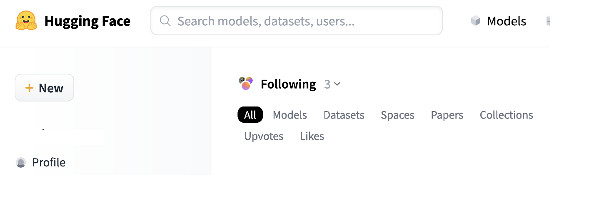

.. _06_where_ais_live:
06 Where do the AIs live?
=====================
.. index:: Fox, server, CUDA, A100, GPU, hardware, hugging face

Huggingface is a place where developers can freely share code, models, and datasets. The LLMs of this workshop come from the platform Huggingface and are downloaded to the Fox. At the Fox server, you have your own storage space. There is also a common space for the group on the server. This is where the AIs are located or temporarily cached. In order to get the AI to work in Jupyter lab, it is essential that you set up the paths in the right way.

.. note::

   Task 6.1: Visit Huggingface and search for google/Pegasus. What do you see? Switch the search to meta-llama/Llama-3.1-8B-Instruct and read. Is this a model that you can find at Fox? What format is it in? Find the format of the Llama AI at Fox, and google it, in order to find out more about this dataformat.

Further reading
--------------
If you wish, you may read more about the `technical specifications <https://www.uio.no/english/services/it/research/platforms/edu-research/help/fox/system-overview.md>`_ on Fox.

