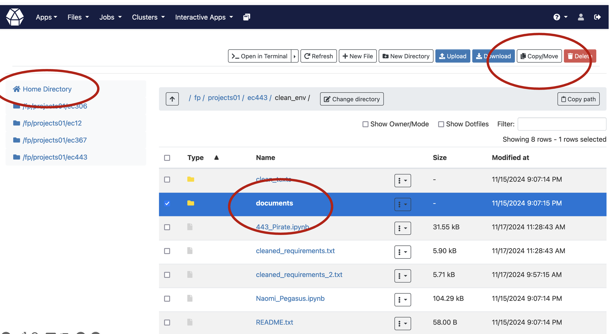
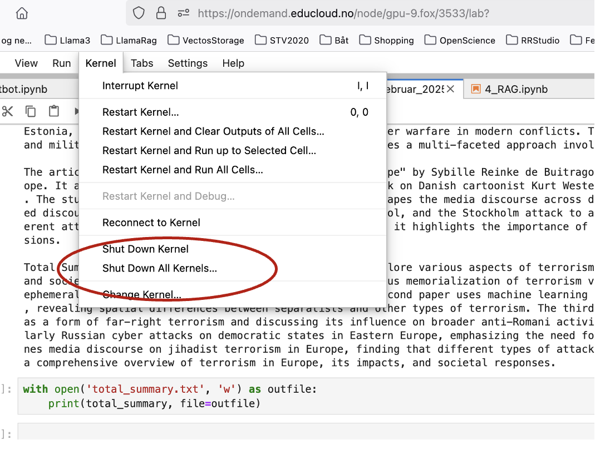

.. _08_summarization:

08 Summarization
==================
We are going to sum up the documents that we have in the folder "documents". The pdfs from this lesson are located on the path "/fp/projects01/ec443/documents". In task number 2 in the chapter on "Easy login", you were asked to make your own documents folder in your home directory. In case you did not get the time, you will now get a second chance. Do the task below, if not done before:

The easiest way doing this, is to use the browser view for Fox. The idea is that you are a researcher with a specific subject in mind. In this case, there was a search for "terrorism" and "western europe" in DOAJ.

.. note::
  Task 8.1: Copy all of the content from this path: /fp/projects01/ec443/documents, and move it into your own documents folder named "documents" on your own home directory.

Cell 1::

  document_folder = '/fp/projects01/ec443/documents/terrorism'

Repeating the location of the models, just in case

Cell 2::

  %env HF_HOME=/fp/projects01/ec443/huggingface/cache/

Cell 3::

  from langchain_huggingface.llms import HuggingFacePipeline
  
  llm = HuggingFacePipeline.from_model_id(
        model_id='mistralai/Ministral-8B-Instruct-2410',
        task='text-generation',
        device=0,
        pipeline_kwargs={
            'max_new_tokens': 1000,
            #'do_sample': True,
            #'temperature': 0.3,
            #'num_beams': 4,
        }
    )

Making a prompt
---------------

Cell 4::

  from langchain.chains.combine_documents import create_stuff_documents_chain
  from langchain.chains.llm import LLMChain
  from langchain.prompts import PromptTemplate

Cell 5::
  
  separator = '\nYour Summary:\n'
  prompt_template = '''Write a summary of the following:
  
  {context}
  ''' + separator
  prompt = PromptTemplate(template=prompt_template,
                          input_variables=['context'])

Create chain
-------------
The document loader loads each PDF page as a separate ‘document’. This is partly for technical reasons because that is the way PDFs are structured. Therefore, we use the chain called create_stuff_documents_chain which joins multiple documents into a single large document.

Cell 6::

  chain = create_stuff_documents_chain(llm, prompt)

A function to split the summary from the input. LangChain returns both the input prompt and the generated response in one long text. To get only the summary, we must split the summary from the document that we sent as input.

Cell 7::

  def split_result(result):
      "Split the reply from the prompt, should be done with output parser?"
      position = result.find(separator)
      summary = result[position + len(separator) :]
      return summary

Loading the Documents
----------------------
We use LangChain’s DirectoryLoader to load all in files in document_folder. document_folder is defined at the start of this Notebook.

Cell 8::

  from langchain_community.document_loaders import DirectoryLoader
  
  loader = DirectoryLoader(document_folder)
  documents = loader.load()
  print('number of documents:', len(documents))

Creating the Summaries
------------------------
Now, we can iterate over these documents with a for-loop.

Cell 9::
  
  summaries = {}
  
  for document in documents:
      filename = document.metadata['source']
      print(filename)
      summary = chain.invoke({"context": [document]})
      summary = split_result(summary)
      summaries[filename] = summary
      print('Summary of file', filename)
      print(summary)

Saving the Summaries to Text Files
------------------------------------
Finally, we save the summaries for later use. In the example below, we save all the summaries in the file summaries.txt.

Cell 10::
  
  with open('summaries_2.txt', 'w') as outfile:
      for filename in summaries:
          print('Summary of ', filename, file = outfile)
          print(summaries[filename], file=outfile)
          print(file=outfile)

Make an overall summary
------------------------
See here under `bonus material <https://uio-library.github.io/LLM-course/3_summarizing.html>`_

.. note::

  Task 8.1: The processes of the Chapters Chatbot and Summarization, may be done on the largest and the second largest GPU at Fox (40GB memory). As we advance to the next chapter with RAG, we depend on the largest GPU with its 80GB memory. Make sure you have your job running on the mentioned GPU resource. Also go to the menu in Jupyter lab, and choose as shown in the illustration below: Kernel --> Shut down all kernels. Now, you are going to open a new workbook, save it with a name you choose, and run the RAG process in that new document, without any other content in the cells.

.. note::

  Task 8.2: Lorem ipsum dolor sit

