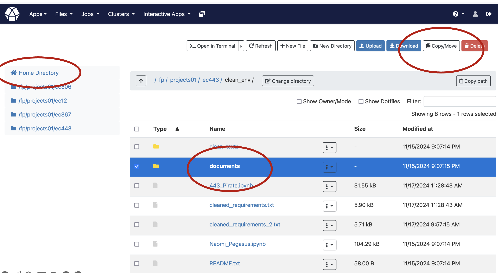
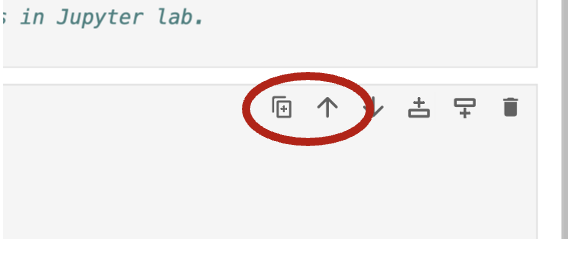

.. _10 pegasus:

10 Pegasus XSum simple summarization
=============================================
.. index:: summarization, open source

.. note:: 
  Task 10.1: Before starting to run summarizations, everyone should move 5 chosen pdfs from a shared space into a folder called "documents" at your homedrive at ec443. The reason is that when you get the output, the user rights management at fox, will be set up much easier if whe do it in the way described here, than if you would choose to make the model generate output on your project area that you have at the same place as the venv. See illustration below. It will also look better in the project area. 

The easiest way doing this, is to use the browser view for Fox. The idea is that you are a researcher, with a specific subject in mind. In this case, I had a search for "terrorism" and "western europe" in DOAJ. Unfortunately, we are not yet technically fit to make the AI participate in doing new scientific discoveries regarding the chosen subject. However, this setup will connect to the right places on the computer, and make the process work. In the project group, we have an ambition to help users do the setup, and generate functioning outputs. We are aspiring to make RAG or other more advanced AI processes once we have started educating our public on how the system is working. We hope you will join us in the further work.

Pro tip but only if something is not working: use pipinstall fitz, frontend, starlette. 
Don't run tis cell, but later if needed.
Code view 0::

  # Install necessary packages directly in Jupyter Notebook
  !pip install fitz frontend starlette --user

Importerer os-modulen for å samhandle med operativsystemet.
Setter PyTorch miljøvariabelen PYTORCH_CUDA_ALLOC_CONF til "expandable_segments:True", som optimaliserer minnehåndtering for CUDA-enheter.
Definerer miljøvariabelen HF_HOME, som angir katalogen hvor Hugging Face-modeller cachen skal lagres.
Code view 1::

  import os
  os.environ["PYTORCH_CUDA_ALLOC_CONF"] = "expandable_segments:True"
  os.environ["HF_HOME"] = "/fp/projects01/ec443/huggingface/cache"

Bekrefter at miljøvariablene er satt korrekt ved å skrive dem ut til konsollen.
code view 2::

  print("PYTORCH_CUDA_ALLOC_CONF:", os.getenv("PYTORCH_CUDA_ALLOC_CONF"))
  print("HF_HOME:", os.getenv("HF_HOME"))

code view 3::

  from transformers import AutoModel, AutoTokenizer
  import torch
  
  # Confirm the import
  print("Packages are successfully imported.")

code view 4::
  
  document_folder = 'documents'
  
  import os
  os.environ["PYTORCH_CUDA_ALLOC_CONF"] = "expandable_segments:True"
  os.environ["HF_HOME"] = "/fp/projects01/ec367/huggingface/cache"
  
  print("PYTORCH_CUDA_ALLOC_CONF:", os.getenv("PYTORCH_CUDA_ALLOC_CONF"))
  print("HF_HOME:", os.getenv("HF_HOME"))

.. todo:: 
   Todo 10.1: Find out do we need both 5 and 6 in order to avoid technical problems?

code view 5::

  # Set Hugging Face cache directory
  %env HF_HOME=/fp/projects01/ec443/huggingface/cache/

This might be redundant. But we do it just in case. We can never be safe enough!
Code view 6::

  # Set Hugging Face Cache Directory in Python
  import os
  os.environ['HF_HOME'] = '/fp/projects01/ec443/huggingface/cache'

This is to be done in terminal, after ssh login
Code view 7::

  # It is advisable to activate your virtual environment before you start the processes in Jupyter lab.
  # source /fp/projects01/ec367/ragnhsu/venv_transformers/bin/activate

This is a long piece of code, but we can do it anyway.
Code view 8::

  # Ignore  expandable_segments error message as the model will still deliver an output
  import os
  from transformers import pipeline, PegasusForConditionalGeneration, PegasusTokenizer
  import fitz  # PyMuPDF for PDF-konvertering, hvis nødvendig
  
  # Definer en unik cache-katalog for Pegasus-XSum prosjektet
  project_cache_dir = "/fp/projects01/ec443/huggingface/cache/Pegasus_XS"
  
  # Opprett katalogen hvis den ikke eksisterer
  os.makedirs(project_cache_dir, exist_ok=True)
  
  # Sett miljøvariabler
  os.environ["PYTORCH_CUDA_ALLOC_CONF"] = "expandable_segments:True"
  os.environ["HF_HOME"] = project_cache_dir
  
  # Bekreft at miljøvariablene er satt korrekt
  print("PYTORCH_CUDA_ALLOC_CONF:", os.getenv("PYTORCH_CUDA_ALLOC_CONF"))
  print("HF_HOME:", os.getenv("HF_HOME"))
  
  # Angi modellnavn
  model_name = "google/pegasus-xsum"
  
  # Last ned modellen og tokenizeren (hvis ikke allerede gjort)
  model = PegasusForConditionalGeneration.from_pretrained(model_name)
  tokenizer = PegasusTokenizer.from_pretrained(model_name)
  
  # Funksjon for å generere sammendrag
  def generate_summary(text, model, tokenizer, max_length=800, num_beams=15, length_penalty=0.3, min_length=250, no_repeat_ngram_size=2):
      """Generer sammendrag ved bruk av Pegasus-modellen med justerbare parametere."""
      
      # max_length: Den maksimale lengden på det genererte sammendraget.
      # num_beams: Antall "beams" for strålesøk, noe som kan øke kvaliteten på genererte tekstsekvenser.
      # length_penalty: Straff for lange sekvenser, en lav verdi (<1) kan oppmuntre lengre utgang.
      # min_length: Minimum lengde på utgangen.
      # no_repeat_ngram_size: Forhindrer gjentakelse av n-grams i utgangen.
      
      tokens = tokenizer(text, truncation=True, padding="longest", return_tensors="pt")
      summary_ids = model.generate(tokens.input_ids, 
                                   max_length=max_length, 
                                   num_beams=num_beams, 
                                   length_penalty=length_penalty, 
                                   min_length=min_length, 
                                   no_repeat_ngram_size=no_repeat_ngram_size, 
                                   early_stopping=True)
      summary = tokenizer.decode(summary_ids[0], skip_special_tokens=True)
      return summary
  
  # Pipeline med device=-1 gir CPU, 0 gir GPU
  try:
      summarizer = pipeline(task="summarization", model=model_name, tokenizer=model_name, device=-0)  # bruker GPU
      print("Successfully set up the summarization pipeline.")
  except Exception as e:
      print(f"There was an error setting up the smmarization pipeline: {e}")
  
  # Angi teksten du ønsker å oppsummere
  input_text = """
  The storm had ceased its wintry roar,\
  Hoarse dash the billows of the sea;\
  But who on Thule's desert shore,\
  Cries, Have I burnt my harp for thee?\
  MACNIEL.\
  That long, narrow, and irregular island, usually called the mainland of\
  Zetland, because it is by far the largest of that Archipelago,\
  terminates, as is well known to the mariners who navigate the stormy\
  seas which surround the Thule of the ancients, in a cliff of immense\
  height, entitled Sumburgh-Head, which presents its bare scalp and naked\
  sides to the weight of a tremendous surge, forming the extreme point of\
  the isle to the south-east. This lofty promontory is constantly exposed\
  to the current of a strong and furious tide, which, setting in betwixt\
  the Orkney and Zetland Islands, and running with force only inferior to\
  that of the Pentland Frith, takes its name from the headland we have\
  mentioned, and is called the Roost of Sumburgh; _roost_ being the phrase\
  assigned in those isles to currents of this description.\
  On the land side, the promontory is covered with short grass, and slopes\
  steeply down to a little isthmus, upon which the sea has encroached in\
  creeks, which, advancing from either side of the island, gradually work\
  their way forward, and seem as if in a short time they would form a\
  junction, and altogether insulate Sumburgh-Head, when what is now a\
  cape, will become a lonely mountain islet, severed from the mainland, of\
  which it is at present the terminating extremity.\
  Man, however, had in former days considered this as a remote or unlikely\
  event; for a Norwegian chief of other times, or, as other accounts said,\
  and as the name of Jarlshof seemed to imply, an ancient Earl of the\
  Orkneys had selected this neck of land as the place for establishing a\
  mansion-house. It has been long entirely deserted, and the vestiges only\
  can be discerned with difficulty; for the loose sand, borne on the\
  tempestuous gales of those stormy regions, has overblown, and almost\
  buried, the ruins of the buildings; but in the end of the seventeenth\
  century, a part of the Earl's mansion was still entire and habitable. It\
  was a rude building of rough stone, with nothing about it to gratify the\
  eye, or to excite the imagination; a large old-fashioned narrow house,\
  with a very steep roof, covered with flags composed of grey sandstone,\
  would perhaps convey the best idea of the place to a modern reader. The\
  windows were few, very small in size, and distributed up and down the\
  building with utter contempt of regularity. Against the main structure\
  had rested, in former times, certain smaller co-partments of the\
  mansion-house, containing offices, or subordinate apartments, necessary\
  for the accommodation of the Earl's retainers and menials. But these had\
  become ruinous; and the rafters had been taken down for fire-wood, or\
  for other purposes; the walls had given way in many places; and, to\
  complete the devastation, the sand had already drifted amongst the\
  ruins, and filled up what had been once the chambers they contained, to\
  the depth of two or three feet.\
  Amid this desolation, the inhabitants of Jarlshof had contrived, by\
  constant labour and attention, to keep in order a few roods of land,\
  which had been enclosed as a garden, and which, sheltered by the walls\
  of the house itself, from the relentless sea-blast, produced such\
  vegetables as the climate could bring forth, or rather as the sea-gale\
  would permit to grow; for these islands experience even less of the\
  rigour of cold than is encountered on the mainland of Scotland; but,\
  unsheltered by a wall of some sort or other, it is scarce possible to\
  raise even the most ordinary culinary vegetables; and as for shrubs or\
  trees, they are entirely out of the question, such is the force of the\
  sweeping sea-blast.\
  At a short distance from the mansion, and near to the sea-beach, just\
  where the creek forms a sort of imperfect harbour, in which lay three or\
  four fishing-boats, there were a few most wretched cottages for the\
  inhabitants and tenants of the township of Jarlshof, who held the whole\
  district of the landlord upon such terms as were in those days usually\
  granted to persons of this description, and which, of course, were hard\
  enough. The landlord himself resided upon an estate which he possessed\
  in a more eligible situation, in a different part of the island, and\
  seldom visited his possessions at Sumburgh-Head. He was an honest, plain\
  Zetland gentleman, somewhat passionate, the necessary result of being\
  surrounded by dependents; and somewhat over-convivial in his habits, the\
  consequence, perhaps, of having too much time at his disposal; but\
  frank-tempered and generous to his people, and kind and hospitable to\
  strangers. He was descended also of an old and noble Norwegian family; a\
  circumstance which rendered him dearer to the lower orders, most of whom\
  are of the same race; while the lairds, or proprietors, are generally of\
  Scottish extraction, who, at that early period, were still considered as\
  """
  
    # Generer sammendrag ved hjelp av generert funksjon
  summary = generate_summary(input_text, model, tokenizer)
  print("Generated Summary with Custom Parameters:\n", summary)
  
  # Alternativt, generer sammendrag ved hjelp av pipelinen
  # summary_pipeline = summarizer(input_text)
  # print("Generated Summary with Pipeline:\n", summary_pipeline[0]['summary_text'])

Scott (1822)

.. note::

  Task 10.2: Use copy cell in jupyter lab in order to get e a copy of the summarization cell. Change some of the parameters, and see if the output changes.
