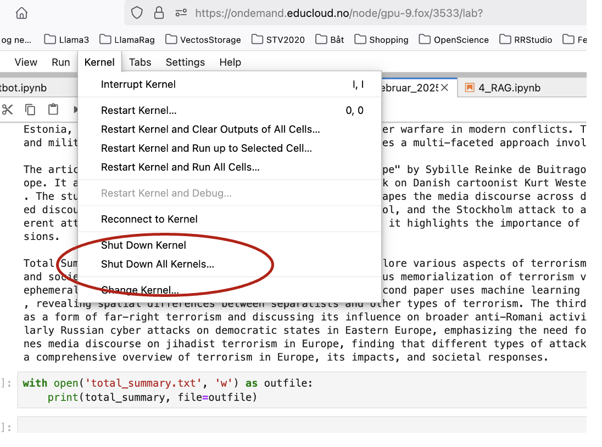

.. _28 problem solving:

Problemløsninger
==================
.. index:: løsninger, problemer, oppdateringer

::

  pip install --upgrade pip

::

  pip install --upgrade torch

Cuda out of memory beskjed
----------------------------

Du trenger å frigjøre minne. Det er ikke nødvendig å kjøre koden i mer enn en notebook av gangen. Meldingen dukker gjerne opp når du jobber med litt tyngre prosesser som oppsummeringer og RAG. I JupyterLab grensesnitt, gå til Kernels --> Shut down all kernels, og prøv igjen med bare en notebook. 

