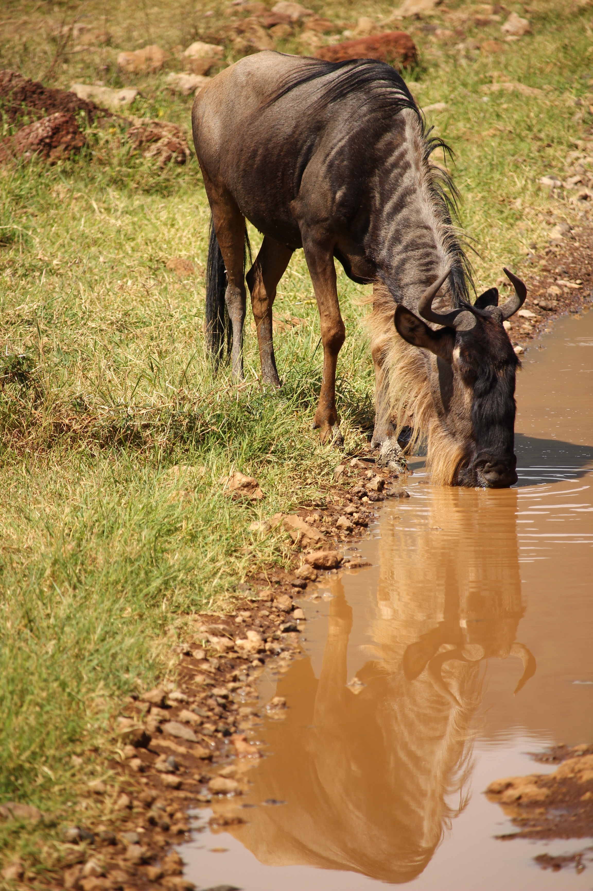

Young female Gnu
================

Young female Gnu Drinking from River
------------------------------------

Photo by 'Fabrizio Frigeni: <https://unsplash.com/@ffrige>' on 'Unsplash: <https://unsplash.com/>'

Photo by ´Fabizio Frigeni´_.
.. _Fabrizio Frigeni: https://unsplash.com/@ffrige 

on ´Unsplash´_.
.. _Unsplash: https://unsplash.com/

Get the latest news at ´CNN´_.

.. _CNN: http://cnn.com/

.. _installation:

Installation
------------

.. image: younggnu.jpg

Water is central for all life on earth
--------------------------------------

To use Lumache, first install it using pip:

.. code-block:: console

   (.venv) $ pip install lumache

See how she enjoys it
---------------------

To retrieve a list of random ingredients,
you can use the ``lumache.get_random_ingredients()`` function:

.. autofunction:: lumache.get_random_ingredients

The ``kind`` parameter should be either ``"meat"``, ``"fish"``,
or ``"veggies"``. Otherwise, :py:func:`lumache.get_random_ingredients`
will raise an exception.

.. autoexception:: lumache.InvalidKindError

For example:

>>> import lumache
>>> lumache.get_random_ingredients()
['shells', 'gorgonzola', 'parsley']

